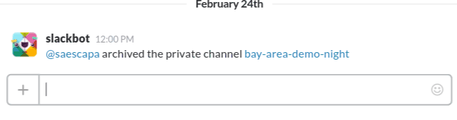

# Fintegration

Access [Fin](https://www.fin.com) through `/fin` on Slack.

## Usage

### Fintegration Setup

First step is to set up the Fintegration server itself. Make sure to set the
following environment variables:

- `SLACK_TOKEN`: This will be the token Slack gives you when you create the
  slash command
- `FIN_TOKEN`: Your token to access Fin. See the
  [Getting Your Fin Token](#getting-your-fin-token) section below for how to get
  this.
- `WHITELIST`: A comma separated list of usernames that are allowed to use
  Fintegration. Ex. `zrl,kwok,bruggie`.

#### Getting Your Fin Token

Instructions for getting your Fin token (this assumes iOS because Fin is only
available on iOS):

1. Download Charles Proxy and launch it (https://www.charlesproxy.com)
2. Go to `Proxy > SSL Proxying Settings` and then click "Add". Set both the host
   and port to `*`. Click "Add" and then "OK" to confirm and get out of this
   prompt.
3. Open http://www.charlesproxy.com/getssl/ on your phone and accept the
   certificate request. Install it.
4. Make sure your phone and your computer are on the same network (and that
   they're accessible to each other, this won't work at most hotels).
  1. On your phone, go to `Settings > Wi-Fi` and then click the `(i)` button
     next to your current Wi-Fi network
  2. Scroll to the bottom until you see "HTTP Proxy" and click "Manual"
  3. Set "Server" to your computer's local IP address (ex. 192.168.0.11). You
     can get this with `ifconfig` or by going to `Help > Local IP Address` in
     Charles.
  4. Set "Port" to `8888`
5. Open up the Fin app on your phone. You should see a confirmation prompt in
   Charles. Accept it.
6. Open up a few messages threads in the Fin app
7. You should see a bunch of HTTPS request to the API flood into Charles. Expand
   the ones for `https://www.getfin.com`, `api`, and `messages` until you see
   requests that say `view`. Click on a request for `view`.
8. In the top tab bar on the right, select the "Request" tab
9. In the bottom tab bar on the right, select the "Form" tab
10. You should see an entry for "token". Double click the token's value to be
    able to copy and paste it.

### Slack Setup

1. Use Slack's interface to create a `/fin` command. Head over to
   https://my.slack.com/services/new/slash-commands to do that. Take note of the
   token field, you'll want to set `SLACK_TOKEN` to this in Integration.
2. Set the `URL` field to the root URL of Fintegration and make sure
   Fintegration is running.
3. Customize the icon to your liking. I like using
   https://www.fin.com/img/favicon/favicon-196x196.png.
4. Try it out! Run `/fin [request]` and you should see your request show up
   in-app.

## License

Fintegration is licensed under the MIT License. See [`LICENSE`](LICENSE) for
the full license text.
